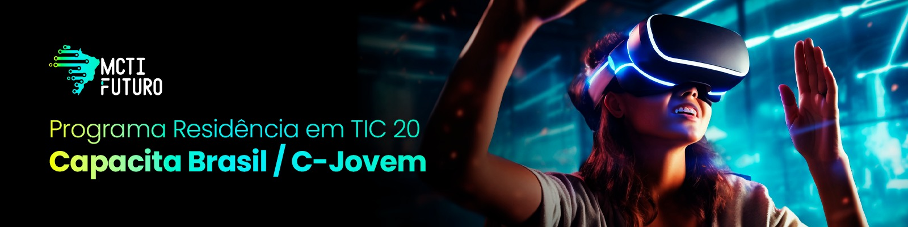

# 👩‍💻 Residência em TIC 20 – Capacita Brasil – C-Jovem 👨‍💻

Seja bem-vindo(a) a **Residência em TIC 20 – Capacita Brasil – C-Jovem**! Aqui você encontrará materiais, projetos e recursos que vão te acompanhar ao longo da sua jornada rumo às áreas mais promissoras da tecnologia: **Ciência de Dados** e **Desenvolvimento de Softwares**. 🚀

## 🎯 Sobre o Programa

O programa oferece **2.200 vagas gratuitas** para jovens que desejam ingressar no mundo da tecnologia com formação e **primeira experiência profissional**. Uma iniciativa 100% online, certificada pela **UECE**, com apoio de mentores e **imersão prática em empresas parceiras**.

## 🌟 Benefícios

- ✅ Formação **gratuita** e **online**
- 🎓 Certificação pela Universidade Estadual do Ceará (UECE)
- 👨‍🏫 Aulas ao vivo e gravadas com apoio de mentores
- 🏢 Imersão prática de **3 meses** em empresas parceiras
- 💼 Bolsa auxílio durante a residência

## 👥 Público-Alvo

Jovens residentes no Ceará que sejam:

1. Estudantes do ensino médio (rede pública ou privada)
2. Concluintes do ensino médio (até 3 anos)
3. Estudantes do ensino superior

**50% das vagas** são reservadas para residentes fora da Região Metropolitana de Fortaleza.

## 📅 Etapas da Formação

| Etapa | Carga Horária | Conteúdo |
|-------|----------------|----------|
| 📘 Formação Básica | 120h | Inglês, Projeto de Vida, Empreendedorismo e Raciocínio Lógico |
| 💻 Formação Técnica | 240h | Full Stack ou Ciência de Dados |
| 🏢 Imersão Profissional | 120h | Residência prática com bolsa auxílio |

---

## 💻 Trilhas de Aprendizado

### 📊 Ciência de Dados

#### Módulo Básico (80h)
- Introdução à IA 🤖
- Estatística e Mineração de Dados 📈
- Banco de Dados 🔍
- Programação com Python 🐍

#### Módulo Intermediário (100h)
- Modelagem e Análise de Dados 📊
- Machine Learning 🤖
- Deep Learning e NLP 🧠
- Projetos Práticos I e II 🛠️

#### Módulo Avançado (60h)
- Projetos Reais 💼
- Técnicas Avançadas de ML 🔬
- IA Generativa ✨
- Projeto Final 🏁

---

### 🚀 Desenvolvimento Full Stack

#### Módulo Inicial – Tecnologias Web (80h)
- Ambiente Web 🌐
- HTML 🧱
- CSS 🎨
- Git/GitHub 🔧
- Projeto Prático 🛠️

#### Módulo Intermediário – Frontend (80h)
- JavaScript Moderno 💡
- Frameworks Frontend ⚛️
- Projeto Prático 🧪

#### Módulo Avançado – Backend (80h)
- Node.js ⚙️
- Banco de Dados SQL 🗃️
- Testes de API 🧪
- Integração Backend + Frontend 🔄
- Projeto Final 🏁

---

## 🧑‍🏫 Metodologia

- Aulas 100% online (ao vivo + gravadas)
- Plataforma de aprendizagem com suporte
- Mentorias ao longo do curso
- Projetos práticos com foco empresarial
- Residência final com **bolsa auxílio**

---

**Vamos juntos transformar seu futuro com tecnologia!** 🚀

